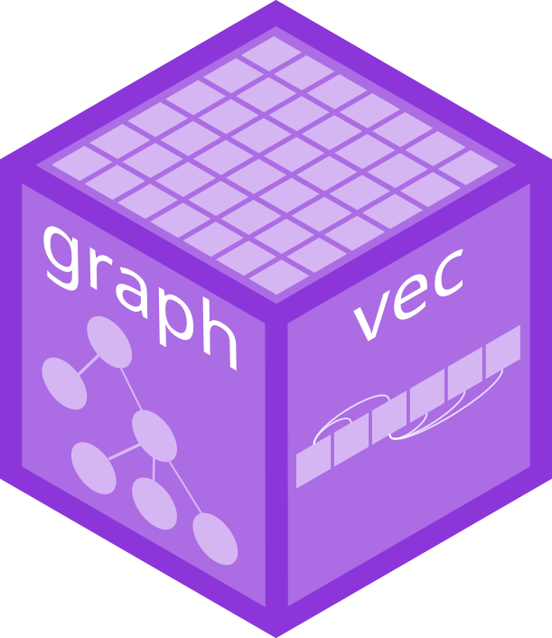

<!-- README.md is generated from README.Rmd. Please edit that file -->

```{r, include = FALSE}
knitr::opts_chunk$set(
  collapse = TRUE,
  comment = "#>",
  fig.path = "man/figures/README-",
  out.width = "100%"
)
```

# graphvec <a href="https://pkg.mitchelloharawild.com/graphvec"></a>

<!-- badges: start -->
[](https://lifecycle.r-lib.org/articles/stages.html#experimental)
[](https://CRAN.R-project.org/package=graphvec)
<!-- badges: end -->

The graphvec package extends vectors to include graph relationships between their unique values, and offers tools to compute useful summaries of the graph structure for use in summarising, filtering, and otherwise manipulating the graph.

## Installation

You can install the development version of graphvec from [GitHub](https://github.com/) with:

``` r
# install.packages("remotes")
remotes::install_github("mitchelloharawild/graphvec")
```

## Examples

```{r}
library(graphvec)
```

### Nodes

A `node_vec()` defines a more general graph structure where nodes can have multiple parents and children.

```{r}
nodes <- node_vec(
  x = factor(c("A", "B", "C", "D", "D", "E")),
  edges = dplyr::tibble(
    from = list(c(1L, 3L), c(2L, 4L)),
    to = c(2L, 5L)
  )
)

nodes
```

These vectors are particularly useful when used in rectangular tidy data structures.

```{r}
dplyr::tibble(nodes, y = rnorm(6))
```

A special case of `node_vec()` is `agg_vec()`, which simply identifies a singular parent node in a given vector with `<aggregated>`. This is a common scenario in data analysis, where a given dimension is aggregated over.

```{r}
agg_vec(
  x = c(NA, "A", "B"),
  aggregated = c(TRUE, FALSE, FALSE)
)
```

### Edges

The transpose of a node vector is an `edge_vec()`, which is instead vectorised along the edges of the graph.

```{r}
e <- edge_vec(
  from = c(1L, 2L, 1L, 3L),
  to = c(2L, 3L, 3L, 1L),
  nodes = dplyr::tibble(
    id = 1:3,
    label = c("A", "B", "C")
  )
)

e
```

Values from nodes can be obtained from an edge vector using `$`.

```{r}
e$from$label
e$to$label
```

### igraph

Both `node_vec()` and `edge_vec()` can be converted to igraph objects for further analysis. Direct vectorised statistics and operations on these vectors are planned for this package in future releases.

```{r}
igraph::as.igraph(nodes)
igraph::as.igraph(e)
```