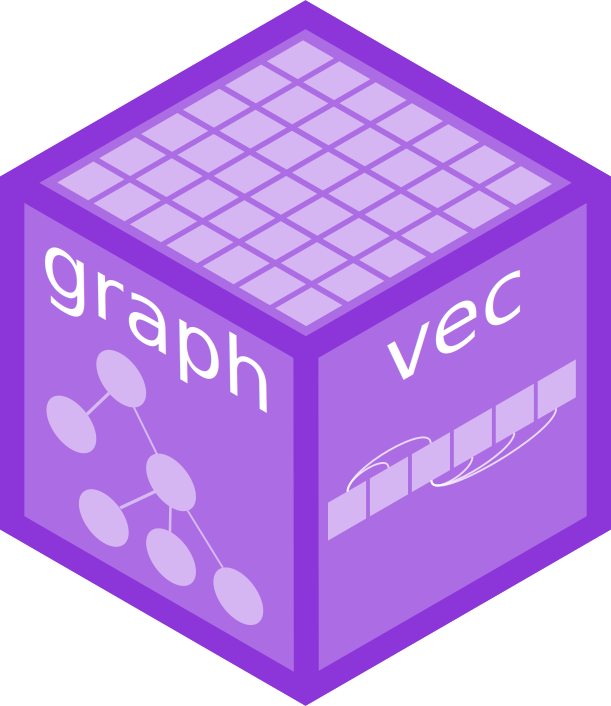

<!-- README.md is generated from README.qmd. Please edit that file -->

# graphvec <a href="https://pkg.mitchelloharawild.com/graphvec"></a>

<!-- badges: start -->

[](https://lifecycle.r-lib.org/articles/stages.html#experimental)
[](https://CRAN.R-project.org/package=graphvec)
<!-- badges: end -->

The graphvec package extends vectors to include graph relationships
between their unique values, and offers tools to compute useful
summaries of the graph structure for use in summarising, filtering, and
otherwise manipulating the graph.

## Installation

You can install the development version of graphvec from
[GitHub](https://github.com/) with:

``` r
# install.packages("remotes")
remotes::install_github("mitchelloharawild/graphvec")
```

## Examples

An `agg_vec()` (aggregation vector) defines a simple hierarchical graph
structure where there is a single parent node.

``` r
library(graphvec)
agg_vec(
  x = c(NA, "A", "B"),
  aggregated = c(TRUE, FALSE, FALSE)
)
#> <agg_vec[3]>
#> [1] <aggregated> A            B
```

A `node_vec()` defines a more general graph structure where nodes can
have multiple parents and children.

``` r
library(dplyr)
#> 
#> Attaching package: 'dplyr'
#> The following objects are masked from 'package:stats':
#> 
#>     filter, lag
#> The following objects are masked from 'package:base':
#> 
#>     intersect, setdiff, setequal, union
g <- node_vec(
  x = factor(c("A", "B", "C", "D", "D", "E")),
  edges = tibble(
    from = list(c(1L, 3L), c(2L, 4L)),
    to = c(2L, 5L)
  )
)

g
#> <node_vec[6]>
#> [1] A B C D D E
```

These vectors are particularly useful when used in rectangular tidy data
structures.

``` r
x <- tibble(g, y = rnorm(6))

x
#> # A tibble: 6 × 2
#>         g       y
#>   <nodes>   <dbl>
#> 1       A -1.82  
#> 2       B -0.0199
#> 3       C  0.933 
#> 4       D  0.247 
#> 5       D -2.20  
#> 6       E  0.824
```

The transpose of a node vector is an `edge_vec()`, which is instead
vectorised along the edges of the graph.

``` r
e <- edge_vec(
  from = c(1L, 2L, 1L, 3L),
  to = c(2L, 3L, 3L, 1L),
  nodes = data.frame(
    id = 1:3,
    label = c("A", "B", "C")
  )
)

e
#> <edge_vec[4]>
#> [1] [1:A]->[2:B] [2:B]->[3:C] [1:A]->[3:C] [3:C]->[1:A]
```

Both `node_vec()` and `edge_vec()` can be converted to igraph objects
for further analysis. Direct vectorised statistics and operations on
these vectors are planned for this package in future releases.

``` r
igraph::as.igraph(g)
#> IGRAPH f826c4e D--- 5 4 -- 
#> + edges from f826c4e:
#> [1] 1->2 3->2 2->5 4->5
igraph::as.igraph(e)
#> IGRAPH 0638902 D--- 3 4 -- 
#> + edges from 0638902:
#> [1] 1->2 2->3 1->3 3->1
```
